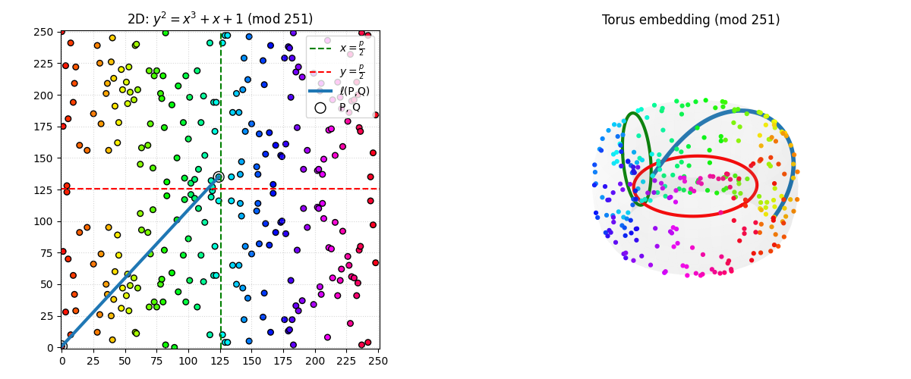

<h1 align="center">ECC-Thesis</h1>

<p align="center">
   
</p>

# Project Description
This Computer Engineering Bachelor's Final Thesis for the University of Granada proposal focuses on the study of elliptic curves applied to cryptography, addressing both its theoretical foundations and its practical application in security systems. The mathematical basis of ECC, its implementations in comparison with traditional methods such as RSA and the discrete logarithm problem will be analyzed. In addition, the impact of quantum computing on the security of these systems will be explored and coding and visualization tools will be developed to illustrate its operation. The work aims to provide a comprehensive and up-to-date view on the potential of elliptic curves in modern cryptography.

# Project Structure
```bash
mi_proyecto_crypto/
├── Makefile
├── include/               # Ficheros .hpp
│   ├── rng.hpp            # Interfaz de generador RNG
│   ├── timer.hpp          # Wrapper de temporización
│   ├── rsa.hpp            # Clases y funciones RSA
│   └── ecc.hpp            # Clases y funciones ECC
├── src/                   # Implementaciones .cpp
│   ├── rng.cpp
│   ├── timer.cpp
│   ├── rsa.cpp
│   └── ecc.cpp
├── bench/                 # Código de benchmarking
│   └── bench_main.cpp     # Script principal de pruebas
├── scripts/               # Scripts auxiliares (bash, Python)
│   ├── run_bench.sh       # Automatiza la ejecución de pruebas
│   └── analyze_results.py # (Opcional) Post-procesado con matplotlib
├── data/                  # Datos estáticos (semillas, curvas, etc.)
│   └── seeds.bin          # Semillas pre-generadas
├── results/               # Salidas de bench (CSV, logs)
└── docs/                  # Documentación y especificaciones
    └── proyecto.md
```