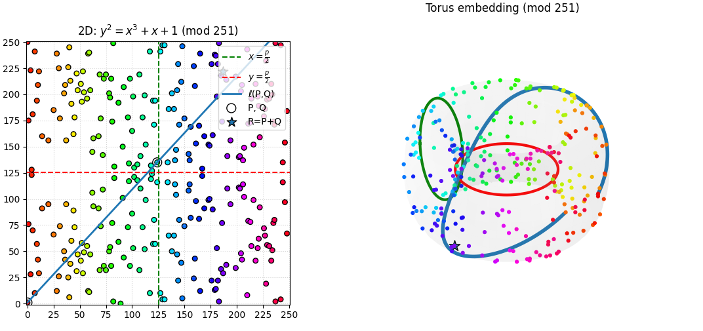

<h1 align="center">ECC-Thesis</h1>

<p align="center">
   
</p>

---

## Table of Contents

- [ECC-Thesis](#ecc-thesis)
  - [1. Project Description](#1--project-description)
  - [2. Project Structure](#2--project-structure)
  - [3. CI / GitHub Workflows](#3-ci-/-github-workflows)
  - [4. Docker Image](#4--docker-image)
    - [Files](#files)
    - [Usage](#usage)
      - [1. Build the image](#1-build-the-image)
      - [2. Start a shell](#2-start-a-shell)
      - [3. Compile into `bin/`](#3-compile-into-bin)
      - [4. Run your binary](#4-run-your-binary)
  - [Local-override vs General](#local-override-vs-general)
  - [5. Testing](#5-testing)
    - [Manual tests](#manual-tests)

## 1. Project Description

This Computer Engineering Bachelor's Final Thesis for the University of Granada proposal focuses on the study of elliptic curves applied to cryptography, addressing both its theoretical foundations and its practical application in security systems. The mathematical basis of ECC, its implementations in comparison with traditional methods such as RSA and the discrete logarithm problem will be analyzed. In addition, the impact of quantum computing on the security of these systems will be explored and coding and visualization tools will be developed to illustrate its operation. The work aims to provide a comprehensive and up-to-date view on the potential of elliptic curves in modern cryptography.

The project also includes a Docker-based environment for compiling and running the code, which is designed to be easily portable and reproducible. The Docker image includes the necessary libraries and tools for working with elliptic curves, such as GMP and NTL.

## 2. Project Structure

```bash
mi_proyecto_crypto/
├── Makefile
├── include/               # Ficheros .hpp
│   ├── rng.hpp            # Interfaz de generador RNG
│   ├── timer.hpp          # Wrapper de temporización
│   ├── rsa.hpp            # Clases y funciones RSA
│   └── ecc.hpp            # Clases y funciones ECC
├── src/                   # Implementaciones .cpp
│   ├── rng.cpp
│   ├── timer.cpp
│   ├── rsa.cpp
│   └── ecc.cpp
├── bench/                 # Código de benchmarking
│   └── bench_main.cpp     # Script principal de pruebas
├── scripts/               # Scripts auxiliares (bash, Python)
│   ├── run_bench.sh       # Automatiza la ejecución de pruebas
│   └── analyze_results.py # (Opcional) Post-procesado con matplotlib
├── data/                  # Datos estáticos (semillas, curvas, etc.)
│   └── seeds.bin          # Semillas pre-generadas
├── bin/                   # Ejecutables compilados
├── results/               # Salidas de bench (CSV, logs)
├── docs/                  # Documentación y especificaciones
│   └── proyecto.md
├── Dockerfile             # Define el contenedor con GMP & NTL
├── docker-compose.yml     # Compose (general-purpose) creando servicio `crypto`
└── docker-compose.local.yml # (opcional) Compose apuntando a tu ruta USB
```

## 3. CI / GitHub Workflows

The repository includes a `docker-publish.yml` file and a `test.yml` for GitHub Actions to automatically rebuild and publish our Docker image on every push to `main` or when a new tag is created.

### Workflow file

- **`.github/workflows/docker-publish.yml`**: is an automation that, when a push is made to GitHub and changes are detected in the dependencies of any of the languages or the Dockerfile, it automatically rebuilds the image and uploads it to DockerHub under `leonfullxr/ecc-benchmarks:latest`.
- **`.github/workflows/test.yml`**: On every push or PR to `main`:
  1. Checks out your code  
  2. Pulls the latest image from Docker Hub  
  3. Runs a quick non-interactive command inside the container (e.g. `make`) to verify it launches correctly

### Secrets

In your fork (or upstream) you must configure two repository secrets under **Settings → Secrets and variables → Actions**:

```yaml
DOCKERHUB_USERNAME: your-dockerhub-username   # e.g. "leonfullxr"
DOCKERHUB_TOKEN:    your-dockerhub-access-token
```

## 4. Docker Image

We provide a containerized environment with **GMP 6.3.0** and **NTL 11.5.1** pre-installed. The `/workspace/bin` directory is automatically added to `PATH`, so any executable you compile there can be run by name.

## Files

* **Dockerfile**
  Builds on Ubuntu 22.04, installs build tools, GMP 6.3.0, then NTL 11.5.1.

* **docker-compose.yml**
  General-purpose compose file. Mounts your current project folder (`.`) into `/workspace`.

* **docker-compose.local.yml**
  (Optional) If you’re working from `/media/…` (like me) and need a custom host path, you can override the volume mount here.

## Usage

You can download the image from Docker Hub and run it:

```bash
# pull the image
docker pull leonfullxr/ecc-benchmarks:latest

# run an interactive shell
docker run --rm -it \
  -v "$(pwd)":/workspace \
  -w /workspace \
  leonfullxr/ecc-benchmarks:latest \
  bash
```

Or you can build it locally.

### 1. Build the image

From your project root:

```bash
docker compose build
```

Or, if you want to use Docker directly:

```bash
docker build -t ecc-thesis .
```

### 2. Start a shell

With Compose:

```bash
docker compose run crypto
```

With plain Docker:

```bash
docker run --rm -it \
  -v "$(pwd)":/workspace \
  -w /workspace \
  ecc-thesis
```

You’ll land in `/workspace`, with `/workspace/bin` on your `PATH`.

### 3. Compile into `bin/`

All your `.cpp` files live in `src/`, headers in `include/`, and you’ll place executables in `bin/`. For example:

```bash
g++ -std=c++17 \
    -I/usr/local/include \
    src/my_ecc.cpp \
    -L/usr/local/lib -lntl -lgmp -pthread \
    -o bin/ecc_demo
```

### 4. Run your binary

```bash
make
./bin/bench -h
./bin/bench -a RSA -b 4096 -i 5 -s fixed
```

## Local-override vs General

* **General use**:
  When someone does a plain `git clone …` anywhere on their filesystem, they run:

```bash
  docker-compose up --build
  docker-compose run crypto
```

  Compose will pick up `docker-compose.yml` and bind `.` → `/workspace`.

* **USB-path override**:
  If you need to mount a weird host path (like me) from your USB drive, use:

```bash
  docker-compose -f docker-compose.local.yml up -d --build
  docker-compose -f docker-compose.local.yml run crypto
```

## 5. Testing

You can run the provided benchmarks inside the container to verify everything is working correctly:

```bash
bash scripts/quick_demo.sh
bash scripts/benchmark_comparison.sh
```

<details>
<summary>Example output from `quick_demo.sh`:</summary>

```
root@5ec6aae22fc8:/workspace# bash scripts/quick_demo.sh 

╔════════════════════════════════════════════════════════════════════╗
║                    RSA vs ECC BENCHMARK - DEMO                     ║
║                   Leon Elliott Fuller - 2025                       ║
╚════════════════════════════════════════════════════════════════════╝

 Compilando proyecto...
 Compilación exitosa

━━━━━━━━━━━━━━━━━━━━━━━━━━━━━━━━━━━━━━━━━━━━━━━━━━━━━━━━━━━━━━━━━━━━
  DEMO 1: Generación de claves RSA (1024-bit, 5 iteraciones)
━━━━━━━━━━━━━━━━━━━━━━━━━━━━━━━━━━━━━━━━━━━━━━━━━━━━━━━━━━━━━━━━━━━━


================================================================================
BENCHMARK CONFIGURATION
================================================================================
  Algorithm:    RSA
  Key size:     1024 bits
  Iterations:   5
  Mode:         seq
  Seed mode:    fixed
  Seed value:   0
================================================================================

================================================================================
RSA BENCHMARK - 1024 bits
================================================================================
Running RSA Key Generation (1024-bit) (5 iterations)... Done!

Generating RSA keypair for encryption/decryption tests...
Running RSA Encryption (1024-bit) (5 iterations)... Done!
Running RSA Decryption (1024-bit, no CRT) (5 iterations)... Done!
Running RSA Decryption (1024-bit, with CRT) (5 iterations)... Done!

--------------------------------------------------------------------------------
RESULTS SUMMARY
--------------------------------------------------------------------------------

=== RSA Key Generation (1024-bit) ===
  Iterations:   5
  Average:      1430 µs
  Min:          451 µs
  Max:          2678 µs
  Total:        7152 µs

=== RSA Encryption (1024-bit) ===
  Iterations:   5
  Average:      3 µs
  Min:          3 µs
  Max:          4 µs
  Total:        16 µs

=== RSA Decryption (1024-bit, no CRT) ===
  Iterations:   5
  Average:      182 µs
  Min:          181 µs
  Max:          189 µs
  Total:        914 µs

=== RSA Decryption (1024-bit, with CRT) ===
  Iterations:   5
  Average:      58 µs
  Min:          57 µs
  Max:          60 µs
  Total:        291 µs

================================================================================

━━━━━━━━━━━━━━━━━━━━━━━━━━━━━━━━━━━━━━━━━━━━━━━━━━━━━━━━━━━━━━━━━━━━
  DEMO 2: Comparación de cifrado vs descifrado (con y sin CRT)
━━━━━━━━━━━━━━━━━━━━━━━━━━━━━━━━━━━━━━━━━━━━━━━━━━━━━━━━━━━━━━━━━━━━

Running RSA Encryption (2048-bit) (5 iterations)... Done!
Running RSA Decryption (2048-bit, no CRT) (5 iterations)... Done!
Running RSA Decryption (2048-bit, with CRT) (5 iterations)... Done!
  Average:      24170 µs
=== RSA Encryption (2048-bit) ===
  Average:      11 µs
=== RSA Decryption (2048-bit, no CRT) ===
  Average:      1253 µs
=== RSA Decryption (2048-bit, with CRT) ===
  Average:      366 µs

━━━━━━━━━━━━━━━━━━━━━━━━━━━━━━━━━━━━━━━━━━━━━━━━━━━━━━━━━━━━━━━━━━━━
  DEMO COMPLETADA
━━━━━━━━━━━━━━━━━━━━━━━━━━━━━━━━━━━━━━━━━━━━━━━━━━━━━━━━━━━━━━━━━━━━

 Características demostradas:
   Generación de claves RSA con diferentes tamaños
   Cifrado y descifrado RSA
   Optimización CRT (4x más rápido)
   Sistema de semillas reproducible
   Estadísticas detalladas (avg, min, max)

 Para más información, consulte:
   - README.md para documentación completa
   - ./bin/bench -h para opciones disponibles
   - make test-rsa para tests predefinidos

```
</details>

<details>
<summary>Example output from `benchmark_comparison.sh`:</summary>

```
root@5ec6aae22fc8:/workspace# bash scripts/benchmark_comparison.sh 
=============================================================================
BENCHMARK COMPARATIVO RSA - DIFERENTES TAMAÑOS DE CLAVE
=============================================================================

Configuración:
  - Iteraciones por tamaño: 10
  - Modo de semilla: fixed
  - Archivo de salida: benchmark_results_20251206_122427.txt

=============================================================================

Ejecutando benchmark para RSA-1024 bits...
---------------------------------------------------------------------


================================================================================
BENCHMARK CONFIGURATION
================================================================================
  Algorithm:    RSA
  Key size:     1024 bits
  Iterations:   10
  Mode:         seq
  Seed mode:    fixed
  Seed value:   0
================================================================================

================================================================================
RSA BENCHMARK - 1024 bits
================================================================================
Running RSA Key Generation (1024-bit) (10 iterations)............. Done!

Generating RSA keypair for encryption/decryption tests...
Running RSA Encryption (1024-bit) (10 iterations)............. Done!
Running RSA Decryption (1024-bit, no CRT) (10 iterations)............. Done!
Running RSA Decryption (1024-bit, with CRT) (10 iterations)............. Done!

--------------------------------------------------------------------------------
RESULTS SUMMARY
--------------------------------------------------------------------------------

=== RSA Key Generation (1024-bit) ===
  Iterations:   10
  Average:      1587 µs
  Min:          309 µs
  Max:          4019 µs
  Total:        15875 µs

=== RSA Encryption (1024-bit) ===
  Iterations:   10
  Average:      3 µs
  Min:          3 µs
  Max:          4 µs
  Total:        39 µs

=== RSA Decryption (1024-bit, no CRT) ===
  Iterations:   10
  Average:      198 µs
  Min:          196 µs
  Max:          210 µs
  Total:        1988 µs

=== RSA Decryption (1024-bit, with CRT) ===
  Iterations:   10
  Average:      69 µs
  Min:          69 µs
  Max:          73 µs
  Total:        699 µs

================================================================================
Completado RSA-1024

Ejecutando benchmark para RSA-2048 bits...
---------------------------------------------------------------------


================================================================================
BENCHMARK CONFIGURATION
================================================================================
  Algorithm:    RSA
  Key size:     2048 bits
  Iterations:   10
  Mode:         seq
  Seed mode:    fixed
  Seed value:   0
================================================================================

================================================================================
RSA BENCHMARK - 2048 bits
================================================================================
Running RSA Key Generation (2048-bit) (10 iterations)............. Done!

Generating RSA keypair for encryption/decryption tests...
Running RSA Encryption (2048-bit) (10 iterations)............. Done!
Running RSA Decryption (2048-bit, no CRT) (10 iterations)............. Done!
Running RSA Decryption (2048-bit, with CRT) (10 iterations)............. Done!

--------------------------------------------------------------------------------
RESULTS SUMMARY
--------------------------------------------------------------------------------

=== RSA Key Generation (2048-bit) ===
  Iterations:   10
  Average:      18509 µs
  Min:          5251 µs
  Max:          43294 µs
  Total:        185091 µs

=== RSA Encryption (2048-bit) ===
  Iterations:   10
  Average:      11 µs
  Min:          11 µs
  Max:          17 µs
  Total:        119 µs

=== RSA Decryption (2048-bit, no CRT) ===
  Iterations:   10
  Average:      1290 µs
  Min:          1283 µs
  Max:          1299 µs
  Total:        12906 µs

=== RSA Decryption (2048-bit, with CRT) ===
  Iterations:   10
  Average:      376 µs
  Min:          374 µs
  Max:          380 µs
  Total:        3765 µs

================================================================================
Completado RSA-2048

Ejecutando benchmark para RSA-3072 bits...
---------------------------------------------------------------------


================================================================================
BENCHMARK CONFIGURATION
================================================================================
  Algorithm:    RSA
  Key size:     3072 bits
  Iterations:   10
  Mode:         seq
  Seed mode:    fixed
  Seed value:   0
================================================================================

================================================================================
RSA BENCHMARK - 3072 bits
================================================================================
Running RSA Key Generation (3072-bit) (10 iterations)............. Done!

Generating RSA keypair for encryption/decryption tests...
Running RSA Encryption (3072-bit) (10 iterations)............. Done!
Running RSA Decryption (3072-bit, no CRT) (10 iterations)............. Done!
Running RSA Decryption (3072-bit, with CRT) (10 iterations)............. Done!

--------------------------------------------------------------------------------
RESULTS SUMMARY
--------------------------------------------------------------------------------

=== RSA Key Generation (3072-bit) ===
  Iterations:   10
  Average:      92115 µs
  Min:          10253 µs
  Max:          255388 µs
  Total:        921154 µs

=== RSA Encryption (3072-bit) ===
  Iterations:   10
  Average:      24 µs
  Min:          23 µs
  Max:          30 µs
  Total:        248 µs

=== RSA Decryption (3072-bit, no CRT) ===
  Iterations:   10
  Average:      4013 µs
  Min:          4005 µs
  Max:          4021 µs
  Total:        40134 µs

=== RSA Decryption (3072-bit, with CRT) ===
  Iterations:   10
  Average:      1157 µs
  Min:          1148 µs
  Max:          1168 µs
  Total:        11570 µs

================================================================================
Completado RSA-3072

Ejecutando benchmark para RSA-4096 bits...
---------------------------------------------------------------------


================================================================================
BENCHMARK CONFIGURATION
================================================================================
  Algorithm:    RSA
  Key size:     4096 bits
  Iterations:   10
  Mode:         seq
  Seed mode:    fixed
  Seed value:   0
================================================================================

================================================================================
RSA BENCHMARK - 4096 bits
================================================================================
Running RSA Key Generation (4096-bit) (10 iterations)............. Done!

Generating RSA keypair for encryption/decryption tests...
Running RSA Encryption (4096-bit) (10 iterations)............. Done!
Running RSA Decryption (4096-bit, no CRT) (10 iterations)............. Done!
Running RSA Decryption (4096-bit, with CRT) (10 iterations)............. Done!

--------------------------------------------------------------------------------
RESULTS SUMMARY
--------------------------------------------------------------------------------

=== RSA Key Generation (4096-bit) ===
  Iterations:   10
  Average:      134016 µs
  Min:          20649 µs
  Max:          268057 µs
  Total:        1340165 µs

=== RSA Encryption (4096-bit) ===
  Iterations:   10
  Average:      39 µs
  Min:          39 µs
  Max:          44 µs
  Total:        395 µs

=== RSA Decryption (4096-bit, no CRT) ===
  Iterations:   10
  Average:      8797 µs
  Min:          8787 µs
  Max:          8820 µs
  Total:        87971 µs

=== RSA Decryption (4096-bit, with CRT) ===
  Iterations:   10
  Average:      2494 µs
  Min:          2489 µs
  Max:          2506 µs
  Total:        24944 µs

================================================================================
Completado RSA-4096

=============================================================================
BENCHMARK COMPLETADO
=============================================================================

Resultados guardados en: benchmark_results_20251206_122427.txt

RESUMEN DE TIEMPOS PROMEDIO (Key Generation):
---------------------------------------------------------------------
   1.   Average:      1587 µs
   2.   Average:      18509 µs
   3.   Average:      92115 µs
   4.   Average:      134016 µs

Para análisis detallado, consulte: benchmark_results_20251206_122427.txt
```

</details>

### Manual tests
You can also compile and run individual tests manually:

```bash
make test-rsa-2k ITERS=10
./bin/bench -a RSA -b 2048 -i 10 -s fixed
./bin/bench -a RSA -b 2048 -i 10 -s random
./bin/bench -a RSA -b 4096 -i 5 -s fixed
```

#### RNG analysis tests
```bash
# Generar 1 millón de números en [0, 1000)
./bin/rng_analysis -n 1000000 -r 1000 -s fixed -o data.csv

# Con semilla aleatoria (timestamp)
./bin/rng_analysis -n 1000000 -r 1000 -s random -o data.csv

# Generar bits individuales
./bin/rng_analysis -n 5000000 -m bits -o bits.csv

# Generar números de 32 bits
./bin/rng_analysis -n 100000 -m fixedbits -b 32 -o data.csv

# Rango más grande
./bin/rng_analysis -n 1000000 -r 100000 -s fixed -o large_range.csv

# Más muestras
./bin/rng_analysis -n 10000000 -r 1000 -s fixed -o many_samples.csv

# Números de 64 bits
./bin/rng_analysis -n 100000 -m fixedbits -b 64 -o 64bit.csv
```

Then analyze the reports and plots directory:

```bash
# Semilla fija 0
./bin/rng_analysis -n 1000000 -r 1000 -s fixed -S 0 -o seed_0.csv

# Semilla fija 12345
./bin/rng_analysis -n 1000000 -r 1000 -s fixed -S 12345 -o seed_12345.csv

# Semilla aleatoria (timestamp)
./bin/rng_analysis -n 1000000 -r 1000 -s random -o seed_random.csv

# Analizar cada uno
python3 scripts/analyze_randomness.py seed_0.csv
python3 scripts/analyze_randomness.py seed_12345.csv
python3 scripts/analyze_randomness.py seed_random.csv
# Ver reporte
cat reports/rng_analysis_*.txt

# Ver gráficas
ls plots/
# Verás: histogram.png, autocorrelation.png, consecutive_pairs.png, etc.
```