<h1 align="center">ECC-Thesis</h1>

<p align="center">
   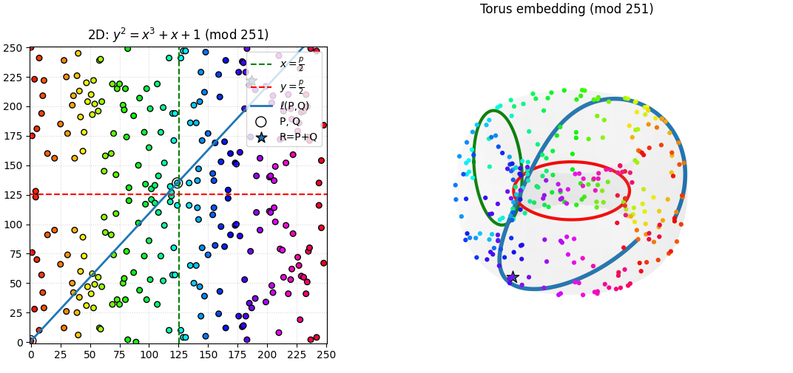
</p>

<p align="center">
   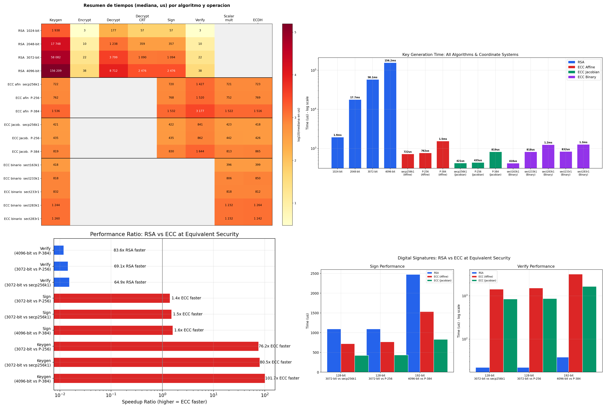
</p>

---

## Table of Contents

- [ECC-Thesis](#ecc-thesis)
  - [1. Project Description](#1--project-description)
  - [2. Project Structure](#2--project-structure)
  - [3. CI / GitHub Workflows](#3-ci-/-github-workflows)
  - [4. Docker Image](#4--docker-image)
    - [Files](#files)
    - [Usage](#usage)
      - [1. Build the image](#1-build-the-image)
      - [2. Start a shell](#2-start-a-shell)
      - [3. Compile into `bin/`](#3-compile-into-bin)
      - [4. Run your binary](#4-run-your-binary)
  - [Local-override vs General](#local-override-vs-general)
  - [5. Testing](#5-testing)
    - [Manual tests](#manual-tests)
    - [RNG analysis tests](#rng-analysis-tests)
  - [6. Benchmarks & Comparative Analysis](#6-benchmarks--comparative-analysis)
    - [Quick Start](#quick-start)
    - [Benchmark Architecture](#benchmark-architecture)
    - [Comparative Results: RSA vs ECC](#comparative-results-rsa-vs-ecc)
    - [Detailed Analysis](#detailed-analysis)
    - [OpenSSL Baseline Comparison](#openssl-baseline-comparison)
    - [Benchmark Methodology](#benchmark-methodology)
    - [External Benchmarking Frameworks](#external-benchmarking-frameworks)
    - [Individual Chart Gallery](#individual-chart-gallery)


## 1. Project Description

This Computer Engineering Bachelor's Final Thesis for the University of Granada proposal focuses on the study of elliptic curves applied to cryptography, addressing both its theoretical foundations and its practical application in security systems. The mathematical basis of ECC, its implementations in comparison with traditional methods such as RSA and the discrete logarithm problem will be analyzed. In addition, the impact of quantum computing on the security of these systems will be explored and coding and visualization tools will be developed to illustrate its operation. The work aims to provide a comprehensive and up-to-date view on the potential of elliptic curves in modern cryptography.

The project also includes a Docker-based environment for compiling and running the code, which is designed to be easily portable and reproducible. The Docker image includes the necessary libraries and tools for working with elliptic curves, such as GMP and NTL.

## 2. Project Structure

```bash
ecc-thesis/
├── Makefile
├── include/                  # Header files (.hpp)
│   ├── common.hpp            # Shared types and constants
│   ├── rng.hpp               # RNG interface
│   ├── rsa.hpp               # RSA classes and functions
│   ├── ecc.hpp               # ECC (prime field, affine + Jacobian coordinates)
│   ├── ecc_binary.hpp        # ECC over binary fields GF(2^m)
│   └── sha256.hpp            # SHA-256 hash (FIPS PUB 180-4)
├── src/                      # Implementation files (.cpp)
│   ├── rng.cpp
│   ├── rsa.cpp
│   ├── ecc.cpp               # Prime field ECC (affine + Jacobian)
│   ├── ecc_binary.cpp        # Binary field ECC (GF(2^m), 5 SEC 2 curves)
│   ├── sha256.cpp
│   └── main.cpp              # Benchmark engine (CSV output, 5 modes)
├── scripts/                  # Automation and analysis scripts
│   ├── run_benchmarks.sh     # Master orchestration script
│   ├── visualize_benchmarks.py   # Chart generation (11 charts)
│   ├── visualize_summary.py      # High-resolution summary heatmap
│   ├── visualize_compiler_flags.py  # Compiler-flags comparison chart
│   ├── create_collages.py    # Combines charts into 3 collages
│   ├── compare_openssl.sh    # OpenSSL baseline comparison
│   ├── compare_compiler_flags.sh    # ECC vs compiler optimization flags
│   ├── run_bench.sh          # Single algorithm runner
│   ├── quick_demo.sh         # Quick demonstration
│   ├── benchmark_comparison.sh   # RSA key size comparison
│   ├── analyze_randomness.py # RNG statistical analysis
│   └── run_rng_analysis.sh   # Full RNG analysis pipeline
├── results/                  # Benchmark outputs
│   ├── summary_*.csv         # Aggregated statistics per benchmark
│   ├── raw_*.csv             # Per-iteration timing data
│   ├── chart_*.png           # Individual charts (11 types)
│   ├── collage_comparison.png          # RSA vs ECC overview (4-panel)
│   ├── collage_detailed.png            # Detailed analysis (4-panel)
│   └── collage_coordinates_fields.png  # Jacobian & binary field analysis (4-panel)
├── data/                     # Static data (seeds, curves, etc.)
├── bin/                      # Compiled executables
├── docs/                     # Documentation
├── Dockerfile                # Container with GMP & NTL
├── docker-compose.yml        # General-purpose compose
└── docker-compose.local.yml  # Optional local path override
```

## 3. CI / GitHub Workflows

The repository includes a `docker-publish.yml` file and a `test.yml` for GitHub Actions to automatically rebuild and publish our Docker image on every push to `main` or when a new tag is created.

### Workflow file

- **`.github/workflows/docker-publish.yml`**: is an automation that, when a push is made to GitHub and changes are detected in the dependencies of any of the languages or the Dockerfile, it automatically rebuilds the image and uploads it to DockerHub under `leonfullxr/ecc-benchmarks:latest`.
- **`.github/workflows/test.yml`**: On every push or PR to `main`:
  1. Checks out your code  
  2. Pulls the latest image from Docker Hub  
  3. Runs a quick non-interactive command inside the container (e.g. `make`) to verify it launches correctly

### Secrets

In your fork (or upstream) you must configure two repository secrets under **Settings → Secrets and variables → Actions**:

```yaml
DOCKERHUB_USERNAME: your-dockerhub-username   # e.g. "leonfullxr"
DOCKERHUB_TOKEN:    your-dockerhub-access-token
```

## 4. Docker Image

We provide a containerized environment with **GMP 6.3.0** and **NTL 11.5.1** pre-installed. The `/workspace/bin` directory is automatically added to `PATH`, so any executable you compile there can be run by name.

## Files

* **Dockerfile**
  Builds on Ubuntu 22.04, installs build tools, GMP 6.3.0, then NTL 11.5.1.

* **docker-compose.yml**
  General-purpose compose file. Mounts your current project folder (`.`) into `/workspace`.

* **docker-compose.local.yml**
  (Optional) If you’re working from `/media/…` (like me) and need a custom host path, you can override the volume mount here.

## Usage

You can download the image from Docker Hub and run it:

```bash
# pull the image
docker pull leonfullxr/ecc-benchmarks:latest

# run an interactive shell
docker run --rm -it \
  -v "$(pwd)":/workspace \
  -w /workspace \
  leonfullxr/ecc-benchmarks:latest \
  bash
```

Or you can build it locally.

### 1. Build the image

From your project root:

```bash
docker compose build
```

Or, if you want to use Docker directly:

```bash
docker build -t ecc-thesis .
```

### 2. Start a shell

With Compose:

```bash
docker compose run crypto
```

With plain Docker:

```bash
docker run --rm -it \
  -v "$(pwd)":/workspace \
  -w /workspace \
  ecc-thesis
```

You’ll land in `/workspace`, with `/workspace/bin` on your `PATH`.

### 3. Compile into `bin/`

All your `.cpp` files live in `src/`, headers in `include/`, and you’ll place executables in `bin/`. For example:

```bash
g++ -std=c++17 \
    -I/usr/local/include \
    src/my_ecc.cpp \
    -L/usr/local/lib -lntl -lgmp -pthread \
    -o bin/ecc_demo
```

### 4. Run your binary

```bash
make
./bin/bench -h
./bin/bench -a RSA -b 4096 -i 5 -s fixed
```

## Local-override vs General

* **General use**:
  When someone does a plain `git clone …` anywhere on their filesystem, they run:

```bash
  docker-compose up --build
  docker-compose run crypto
```

  Compose will pick up `docker-compose.yml` and bind `.` → `/workspace`.

* **USB-path override**:
  If you need to mount a weird host path (like me) from your USB drive, use:

```bash
  docker-compose -f docker-compose.local.yml up -d --build
  docker-compose -f docker-compose.local.yml run crypto
```

## 5. Testing

You can run the provided benchmarks inside the container to verify everything is working correctly:

```bash
bash scripts/quick_demo.sh
bash scripts/benchmark_comparison.sh
```

<details>
<summary>Example output from `quick_demo.sh`:</summary>

```
root@5ec6aae22fc8:/workspace# bash scripts/quick_demo.sh 

╔════════════════════════════════════════════════════════════════════╗
║                    RSA vs ECC BENCHMARK - DEMO                     ║
║                   Leon Elliott Fuller - 2025                       ║
╚════════════════════════════════════════════════════════════════════╝

 Compilando proyecto...
 Compilación exitosa

━━━━━━━━━━━━━━━━━━━━━━━━━━━━━━━━━━━━━━━━━━━━━━━━━━━━━━━━━━━━━━━━━━━━
  DEMO 1: Generación de claves RSA (1024-bit, 5 iteraciones)
━━━━━━━━━━━━━━━━━━━━━━━━━━━━━━━━━━━━━━━━━━━━━━━━━━━━━━━━━━━━━━━━━━━━


================================================================================
BENCHMARK CONFIGURATION
================================================================================
  Algorithm:    RSA
  Key size:     1024 bits
  Iterations:   5
  Mode:         seq
  Seed mode:    fixed
  Seed value:   0
================================================================================

================================================================================
RSA BENCHMARK - 1024 bits
================================================================================
Running RSA Key Generation (1024-bit) (5 iterations)... Done!

Generating RSA keypair for encryption/decryption tests...
Running RSA Encryption (1024-bit) (5 iterations)... Done!
Running RSA Decryption (1024-bit, no CRT) (5 iterations)... Done!
Running RSA Decryption (1024-bit, with CRT) (5 iterations)... Done!

--------------------------------------------------------------------------------
RESULTS SUMMARY
--------------------------------------------------------------------------------

=== RSA Key Generation (1024-bit) ===
  Iterations:   5
  Average:      1430 µs
  Min:          451 µs
  Max:          2678 µs
  Total:        7152 µs

=== RSA Encryption (1024-bit) ===
  Iterations:   5
  Average:      3 µs
  Min:          3 µs
  Max:          4 µs
  Total:        16 µs

=== RSA Decryption (1024-bit, no CRT) ===
  Iterations:   5
  Average:      182 µs
  Min:          181 µs
  Max:          189 µs
  Total:        914 µs

=== RSA Decryption (1024-bit, with CRT) ===
  Iterations:   5
  Average:      58 µs
  Min:          57 µs
  Max:          60 µs
  Total:        291 µs

================================================================================

━━━━━━━━━━━━━━━━━━━━━━━━━━━━━━━━━━━━━━━━━━━━━━━━━━━━━━━━━━━━━━━━━━━━
  DEMO 2: Comparación de cifrado vs descifrado (con y sin CRT)
━━━━━━━━━━━━━━━━━━━━━━━━━━━━━━━━━━━━━━━━━━━━━━━━━━━━━━━━━━━━━━━━━━━━

Running RSA Encryption (2048-bit) (5 iterations)... Done!
Running RSA Decryption (2048-bit, no CRT) (5 iterations)... Done!
Running RSA Decryption (2048-bit, with CRT) (5 iterations)... Done!
  Average:      24170 µs
=== RSA Encryption (2048-bit) ===
  Average:      11 µs
=== RSA Decryption (2048-bit, no CRT) ===
  Average:      1253 µs
=== RSA Decryption (2048-bit, with CRT) ===
  Average:      366 µs

━━━━━━━━━━━━━━━━━━━━━━━━━━━━━━━━━━━━━━━━━━━━━━━━━━━━━━━━━━━━━━━━━━━━
  DEMO COMPLETADA
━━━━━━━━━━━━━━━━━━━━━━━━━━━━━━━━━━━━━━━━━━━━━━━━━━━━━━━━━━━━━━━━━━━━

 Características demostradas:
   Generación de claves RSA con diferentes tamaños
   Cifrado y descifrado RSA
   Optimización CRT (4x más rápido)
   Sistema de semillas reproducible
   Estadísticas detalladas (avg, min, max)

 Para más información, consulte:
   - README.md para documentación completa
   - ./bin/bench -h para opciones disponibles
   - make test-rsa para tests predefinidos

```
</details>

<details>
<summary>Example output from `benchmark_comparison.sh`:</summary>

```
root@5ec6aae22fc8:/workspace# bash scripts/benchmark_comparison.sh 
=============================================================================
BENCHMARK COMPARATIVO RSA - DIFERENTES TAMAÑOS DE CLAVE
=============================================================================

Configuración:
  - Iteraciones por tamaño: 10
  - Modo de semilla: fixed
  - Archivo de salida: benchmark_results_20251206_122427.txt

=============================================================================

Ejecutando benchmark para RSA-1024 bits...
---------------------------------------------------------------------


================================================================================
BENCHMARK CONFIGURATION
================================================================================
  Algorithm:    RSA
  Key size:     1024 bits
  Iterations:   10
  Mode:         seq
  Seed mode:    fixed
  Seed value:   0
================================================================================

================================================================================
RSA BENCHMARK - 1024 bits
================================================================================
Running RSA Key Generation (1024-bit) (10 iterations)............. Done!

Generating RSA keypair for encryption/decryption tests...
Running RSA Encryption (1024-bit) (10 iterations)............. Done!
Running RSA Decryption (1024-bit, no CRT) (10 iterations)............. Done!
Running RSA Decryption (1024-bit, with CRT) (10 iterations)............. Done!

--------------------------------------------------------------------------------
RESULTS SUMMARY
--------------------------------------------------------------------------------

=== RSA Key Generation (1024-bit) ===
  Iterations:   10
  Average:      1587 µs
  Min:          309 µs
  Max:          4019 µs
  Total:        15875 µs

=== RSA Encryption (1024-bit) ===
  Iterations:   10
  Average:      3 µs
  Min:          3 µs
  Max:          4 µs
  Total:        39 µs

=== RSA Decryption (1024-bit, no CRT) ===
  Iterations:   10
  Average:      198 µs
  Min:          196 µs
  Max:          210 µs
  Total:        1988 µs

=== RSA Decryption (1024-bit, with CRT) ===
  Iterations:   10
  Average:      69 µs
  Min:          69 µs
  Max:          73 µs
  Total:        699 µs

================================================================================
Completado RSA-1024

Ejecutando benchmark para RSA-2048 bits...
---------------------------------------------------------------------


================================================================================
BENCHMARK CONFIGURATION
================================================================================
  Algorithm:    RSA
  Key size:     2048 bits
  Iterations:   10
  Mode:         seq
  Seed mode:    fixed
  Seed value:   0
================================================================================

================================================================================
RSA BENCHMARK - 2048 bits
================================================================================
Running RSA Key Generation (2048-bit) (10 iterations)............. Done!

Generating RSA keypair for encryption/decryption tests...
Running RSA Encryption (2048-bit) (10 iterations)............. Done!
Running RSA Decryption (2048-bit, no CRT) (10 iterations)............. Done!
Running RSA Decryption (2048-bit, with CRT) (10 iterations)............. Done!

--------------------------------------------------------------------------------
RESULTS SUMMARY
--------------------------------------------------------------------------------

=== RSA Key Generation (2048-bit) ===
  Iterations:   10
  Average:      18509 µs
  Min:          5251 µs
  Max:          43294 µs
  Total:        185091 µs

=== RSA Encryption (2048-bit) ===
  Iterations:   10
  Average:      11 µs
  Min:          11 µs
  Max:          17 µs
  Total:        119 µs

=== RSA Decryption (2048-bit, no CRT) ===
  Iterations:   10
  Average:      1290 µs
  Min:          1283 µs
  Max:          1299 µs
  Total:        12906 µs

=== RSA Decryption (2048-bit, with CRT) ===
  Iterations:   10
  Average:      376 µs
  Min:          374 µs
  Max:          380 µs
  Total:        3765 µs

================================================================================
Completado RSA-2048

Ejecutando benchmark para RSA-3072 bits...
---------------------------------------------------------------------


================================================================================
BENCHMARK CONFIGURATION
================================================================================
  Algorithm:    RSA
  Key size:     3072 bits
  Iterations:   10
  Mode:         seq
  Seed mode:    fixed
  Seed value:   0
================================================================================

================================================================================
RSA BENCHMARK - 3072 bits
================================================================================
Running RSA Key Generation (3072-bit) (10 iterations)............. Done!

Generating RSA keypair for encryption/decryption tests...
Running RSA Encryption (3072-bit) (10 iterations)............. Done!
Running RSA Decryption (3072-bit, no CRT) (10 iterations)............. Done!
Running RSA Decryption (3072-bit, with CRT) (10 iterations)............. Done!

--------------------------------------------------------------------------------
RESULTS SUMMARY
--------------------------------------------------------------------------------

=== RSA Key Generation (3072-bit) ===
  Iterations:   10
  Average:      92115 µs
  Min:          10253 µs
  Max:          255388 µs
  Total:        921154 µs

=== RSA Encryption (3072-bit) ===
  Iterations:   10
  Average:      24 µs
  Min:          23 µs
  Max:          30 µs
  Total:        248 µs

=== RSA Decryption (3072-bit, no CRT) ===
  Iterations:   10
  Average:      4013 µs
  Min:          4005 µs
  Max:          4021 µs
  Total:        40134 µs

=== RSA Decryption (3072-bit, with CRT) ===
  Iterations:   10
  Average:      1157 µs
  Min:          1148 µs
  Max:          1168 µs
  Total:        11570 µs

================================================================================
Completado RSA-3072

Ejecutando benchmark para RSA-4096 bits...
---------------------------------------------------------------------


================================================================================
BENCHMARK CONFIGURATION
================================================================================
  Algorithm:    RSA
  Key size:     4096 bits
  Iterations:   10
  Mode:         seq
  Seed mode:    fixed
  Seed value:   0
================================================================================

================================================================================
RSA BENCHMARK - 4096 bits
================================================================================
Running RSA Key Generation (4096-bit) (10 iterations)............. Done!

Generating RSA keypair for encryption/decryption tests...
Running RSA Encryption (4096-bit) (10 iterations)............. Done!
Running RSA Decryption (4096-bit, no CRT) (10 iterations)............. Done!
Running RSA Decryption (4096-bit, with CRT) (10 iterations)............. Done!

--------------------------------------------------------------------------------
RESULTS SUMMARY
--------------------------------------------------------------------------------

=== RSA Key Generation (4096-bit) ===
  Iterations:   10
  Average:      134016 µs
  Min:          20649 µs
  Max:          268057 µs
  Total:        1340165 µs

=== RSA Encryption (4096-bit) ===
  Iterations:   10
  Average:      39 µs
  Min:          39 µs
  Max:          44 µs
  Total:        395 µs

=== RSA Decryption (4096-bit, no CRT) ===
  Iterations:   10
  Average:      8797 µs
  Min:          8787 µs
  Max:          8820 µs
  Total:        87971 µs

=== RSA Decryption (4096-bit, with CRT) ===
  Iterations:   10
  Average:      2494 µs
  Min:          2489 µs
  Max:          2506 µs
  Total:        24944 µs

================================================================================
Completado RSA-4096

=============================================================================
BENCHMARK COMPLETADO
=============================================================================

Resultados guardados en: benchmark_results_20251206_122427.txt

RESUMEN DE TIEMPOS PROMEDIO (Key Generation):
---------------------------------------------------------------------
   1.   Average:      1587 µs
   2.   Average:      18509 µs
   3.   Average:      92115 µs
   4.   Average:      134016 µs

Para análisis detallado, consulte: benchmark_results_20251206_122427.txt
```

</details>

### Manual tests
You can also compile and run individual tests manually:

```bash
# RSA benchmarks
./bin/bench -a RSA -b 2048 -i 10 -s fixed
./bin/bench -a RSA -b 4096 -i 5 -s random

# ECC prime field (affine coordinates)
./bin/bench -a ECC -c P-256 -i 10
./bin/bench -a ECC -c P-384 -i 10
./bin/bench -a ECC -c secp256k1 -i 10

# ECC prime field (Jacobian coordinates)
./bin/bench -a ECCJ -c P-256 -i 10
./bin/bench -a ECCJ -c secp256k1 -i 10

# ECC binary field GF(2^m)
./bin/bench -a BIN -c sect163k1 -i 5
./bin/bench -a BIN -c sect283k1 -i 5
./bin/bench -a BIN -c sect233r1 -i 5

# Full 3-dimensional comparison (all algorithms, all coordinate systems)
./bin/bench -a CMP -i 20 -v > results/summary.csv
```

#### RNG analysis tests
This is essential to ensure the quality of our Random Number Generator (RNG) used in key generation and other cryptographic operations.

For a more detailed statistical analysis of the RNG, you can read the [RNG readme](rng.md) file. Here are some example commands to run the RNG analysis with different parameters:

```bash
# Con semilla aleatoria (timestamp)
./bin/rng_analysis -n 1000000 -r 1000 -s random -o data.csv

# Rango más grande
./bin/rng_analysis -n 1000000 -r 100000 -s fixed -o large_range.csv

# Números de 64 bits
./bin/rng_analysis -n 100000 -m fixedbits -b 64 -o 64bit.csv
```

Then analyze the reports and plots directory:

```bash
# Probar con 2048 bits
./bin/rng_analysis -n 100000 -m fixedbits -b 2048 -o results/data/rsa2048.csv -v

python3 scripts/analyze_randomness.py results/data/rsa2048.csv results/plots
# Ver reporte
cat reports/rng_analysis_*.txt

# Ver gráficas
ls plots/
# Verás: histogram.png, autocorrelation.png, consecutive_pairs.png, etc.
```

#### Running the full RNG analysis script
You can run the complete RNG analysis script which automates data generation, analysis, and plotting:

<details>
<summary>Example output from `run_rng_analysis.sh`:</summary>

```bash
root@18fbc909a7d0:/workspace# bash scripts/run_rng_analysis.sh 

====================================================================
         ANÁLISIS ESTADÍSTICO COMPLETO DEL RNG                     
====================================================================

====================================================================
  PASO 1: Compilando herramienta de análisis
====================================================================

  rng_analysis ya compilado

====================================================================
  PASO 2: Verificando dependencias Python
====================================================================

  Python version: Python 3.10.12

  Verificando paquetes Python...
  Todos los paquetes instalados

====================================================================
  PASO 3: Generando datasets de números aleatorios
====================================================================

  [1/4] Generando números acotados (1M samples)...

======================================================================
RNG DATA GENERATOR v3.0
======================================================================
  Output file:      results/data/bounded.csv
  Samples:          1000000
  Generation mode:  bounded
  Range:            [0, 1000)
  Seed mode:        fixed
  Seed value:       0
  Normalized:       YES
======================================================================

Generating 1000000 normalized numbers [0.0, 1.0]...
  Original range: [0, 1000)
  Generated 1000000 / 1000000
Generated 1000000 normalized numbers

======================================================================
COMPLETED
======================================================================
  Time elapsed:     267 ms
  Rate:             3.74532e+06 samples/sec
  Output file:      results/data/bounded.csv
  Data range:       [0.0, 1.0] (normalized)
======================================================================

Next step: Analyze with Python:
  python3 scripts/analyze_randomness.py results/data/bounded.csv results/plots


  [2/4] Generando bits individuales (5M samples)...

======================================================================
RNG DATA GENERATOR v3.0
======================================================================
  Output file:      results/data/bits.csv
  Samples:          5000000
  Generation mode:  bits
  Seed mode:        fixed
  Seed value:       0
  Normalized:       NO
======================================================================

Generating 5000000 random bits...
  Generated 5000000 / 5000000
Generated 5000000 bits

======================================================================
COMPLETED
======================================================================
  Time elapsed:     452 ms
  Rate:             1.10619e+07 samples/sec
  Output file:      results/data/bits.csv
======================================================================

Next step: Analyze with Python:
  python3 scripts/analyze_randomness.py results/data/bits.csv results/plots


  [3/4] Generando números de 2046 bits (100K samples)...

======================================================================
RNG DATA GENERATOR v3.0
======================================================================
  Output file:      results/data/fixedbits2046.csv
  Samples:          100000
  Generation mode:  fixedbits
  Bits per number:  2046
  Seed mode:        fixed
  Seed value:       0
  Normalized:       YES
======================================================================

Generating 100000 numbers of 2046 bits (normalized)...
  Generated 100000 / 100000
Generated 100000 normalized numbers

======================================================================
COMPLETED
======================================================================
  Time elapsed:     61 ms
  Rate:             1.63934e+06 samples/sec
  Output file:      results/data/fixedbits2046.csv
  Data range:       [0.0, 1.0] (normalized)
======================================================================

Next step: Analyze with Python:
  python3 scripts/analyze_randomness.py results/data/fixedbits2046.csv results/plots


  [4/4] Generando pares consecutivos (100K samples)...

======================================================================
RNG DATA GENERATOR v3.0
======================================================================
  Output file:      results/data/pairs.csv
  Samples:          100000
  Generation mode:  pairs
  Range:            [0, 10000)
  Seed mode:        fixed
  Seed value:       0
  Normalized:       YES
======================================================================

Generating 100000 consecutive pairs (normalized)...
  Generated 100000 / 100000
Generated 100000 pairs

======================================================================
COMPLETED
======================================================================
  Time elapsed:     51 ms
  Rate:             1.96078e+06 samples/sec
  Output file:      results/data/pairs.csv
  Data range:       [0.0, 1.0] (normalized)
======================================================================

Next step: Analyze with Python:
  python3 scripts/analyze_randomness.py results/data/pairs.csv results/plots


====================================================================
  PASO 4: Ejecutando análisis estadístico
====================================================================

  Analizando dataset principal (números acotados)...

======================================================================
  ANÁLISIS ESTADÍSTICO DE ALEATORIEDAD
======================================================================
  Archivo de entrada: results/data/bounded.csv

  Cargando datos...
  Cargados 1,000,000 valores
  Rango: [0.000000, 1.000000] (normalizado)

======================================================================
  SUITE COMPLETA DE TESTS ESTADÍSTICOS
======================================================================

======================================================================
  ANÁLISIS DE MEDIA Y VARIANZA
======================================================================
  Media observada:  0.5002
  Media esperada:   0.5000
  Var. observada:   0.0834
  Var. esperada:    0.0833
  P-value (media):  0.387811
  Resultado:        PASS

======================================================================
  TEST DE UNIFORMIDAD (Chi-cuadrado)
======================================================================
  Chi-cuadrado:     9.2236
  Grados libertad:  9
  P-value:          0.416894
  Resultado:        PASS (alpha=0.05)
  -> Los datos SON uniformes (no rechazo H0)

======================================================================
  TEST DE KOLMOGOROV-SMIRNOV
======================================================================
  Estadístico KS:   0.001254
  P-value:          0.086191
  Resultado:        PASS (alpha=0.05)

======================================================================
  TEST DE RUNS (RACHAS)
======================================================================
  Runs observados:  500220
  Runs esperados:   500000.75
  Z-score:          0.3101
  P-value:          0.756507
  Resultado:        PASS (alpha=0.05)

======================================================================
  TEST DE AUTOCORRELACIÓN
======================================================================
  Lags analizados:  20
  Límite confianza: ±0.0020
  Violaciones:      3 / 20
  Máximo permitido: 2
  Resultado:        FAIL

======================================================================
  ANÁLISIS DE ENTROPÍA
======================================================================
  Entropía:         7.9957 bits
  Entropía máxima:  8.0000 bits
  Ratio:            99.9459%
  Resultado:        PASS

======================================================================
  RESUMEN DE RESULTADOS
======================================================================
  Media y Varianza          PASS
  Uniformidad (Chi²)        PASS
  Kolmogorov-Smirnov        PASS

```

</details>

## 6. Benchmarks & Comparative Analysis

This section documents the comparative performance analysis across three dimensions:

1. RSA vs ECC - Fundamentally different algorithms (factorization vs ECDLP)
2. Affine vs Jacobian coordinates - Same math, different point representation (clarity vs speed)
3. Prime field Fp vs Binary field GF(2^m) - Same algebraic structure, different arithmetic

All comparisons use equivalent security levels as defined by NIST SP 800-57: RSA-3072 vs P-256/secp256k1 (128-bit security) and RSA-4096 vs P-384 (192-bit security). Binary field comparisons use sect283k1 (~128-bit) and sect233k1 (~112-bit).

### Quick Start

The whole experimental pipeline is wrapped in `make` targets so everything is reproducible with a single command:

```bash
make benchmark               # Full RSA vs ECC suite (100 iters) + all charts
make compare-openssl         # OpenSSL baseline (50s per operation)
make compare-compiler-flags  # ECC performance across -O0/-O1/-O2/-O3/-Ofast/-march=native + chart
make figures                 # Regenerate every chart and copy them into docs/.../imagenes/
make reproduce               # Everything above, in order (full reproduction)
```

Useful overridable variables:

```bash
make benchmark OPT=-O2 BENCH_ITERS=100   # reproduce the thesis numbers exactly (no -march=native)
make compare-openssl OPENSSL_SECONDS=50
make compare-compiler-flags FLAG_ITERS=100
```

`make` (no target) lists every available target with a short description.

<details>
<summary>Running the steps manually</summary>

```bash
# Full pipeline: compile, benchmark, and generate charts
bash scripts/run_benchmarks.sh 100

# Or run steps individually:

# 1. Compile
docker run --rm -it -v $(pwd):/workspace ecc-thesis bash -c "make"


# 2. Run full comparison (CSV to stdout, verbose progress to stderr)
./bin/bench -a CMP -i 100 -r results/raw.csv -v > results/summary.csv

# 3. Generate visualizations
python3 scripts/visualize_benchmarks.py results/summary.csv results/raw.csv results/
python3 scripts/visualize_summary.py results/summary.csv results/

# 4. Create collage images
python3 scripts/create_collages.py results results
```
</details>

The benchmark engine supports five modes:

```bash
./bin/bench -a RSA  -b 2048 -i 50 -v > rsa_only.csv      # RSA only
./bin/bench -a ECC  -c P-256 -i 50 -v > ecc_affine.csv    # ECC affine
./bin/bench -a ECCJ -c P-256 -i 50 -v > ecc_jacobian.csv  # ECC Jacobian
./bin/bench -a BIN  -c sect283k1 -i 10 -v > binary.csv    # ECC binary field
./bin/bench -a CMP  -i 100 -r raw.csv -v > comparison.csv  # Full 3D comparison
```

### Benchmark Architecture

The benchmark system is split into three layers that reuse the existing cryptographic modules:

Each benchmark includes 3 warm-up iterations (discarded) followed by N measured iterations, and reports the following statistics: mean, median, standard deviation, min, max, and percentiles P5/P95. The use of `std::chrono::high_resolution_clock` provides microsecond resolution which is sufficient for operations in the 100us-1s range. The `-a CMP` mode generates ~72 benchmarks: 4 RSA sizes x 6 ops, 3 prime curves x 6 ops (affine), 3 prime curves x 5 ops (Jacobian), 5 binary curves x 3 ops.

### Comparative Results: RSA vs ECC

The following collage summarizes the key findings from running the full suite of 72 benchmarks (4 RSA key sizes x 6 operations + 3 prime curves x 6 ops in affine + 3 prime curves x 5 ops in Jacobian + 5 binary curves x 3 ops):

<p align="center">
   
</p>

**Key findings at equivalent security levels (128-bit: RSA-3072 vs P-256/secp256k1), median of 100 iterations:**

| Operation | RSA-3072 | ECC (secp256k1) | ECC (P-256) | Winner |
|-----------|----------|-----------------|-------------|--------|
| Key Generation | ~58 ms | ~0.72 ms | ~0.77 ms | **ECC ~80x faster** |
| Sign | ~1.09 ms | ~0.73 ms | ~0.77 ms | **ECC ~1.5x faster** |
| Verify | ~22 us | ~1.44 ms | ~1.52 ms | **RSA ~65x faster** |

ECC times above use affine coordinates; switching to Jacobian coordinates makes ECC a further ~1.7-2x faster (e.g. secp256k1 keygen drops to ~0.42 ms, raising the keygen advantage to ~138x). The results reveal that ECC has a massive advantage in key generation because RSA must find two large primes while ECC only needs a random scalar multiplication. For signing, ECC is moderately faster (~1.5x). However, RSA verification is dramatically faster (~65x) due to the small public exponent e=65537, which requires only 17 squarings and 1 multiplication versus the full scalar multiplication ECC needs.

### Affine vs Jacobian Coordinates
 
The third collage shows the direct comparison between coordinate systems and field types:
 
<p align="center">
   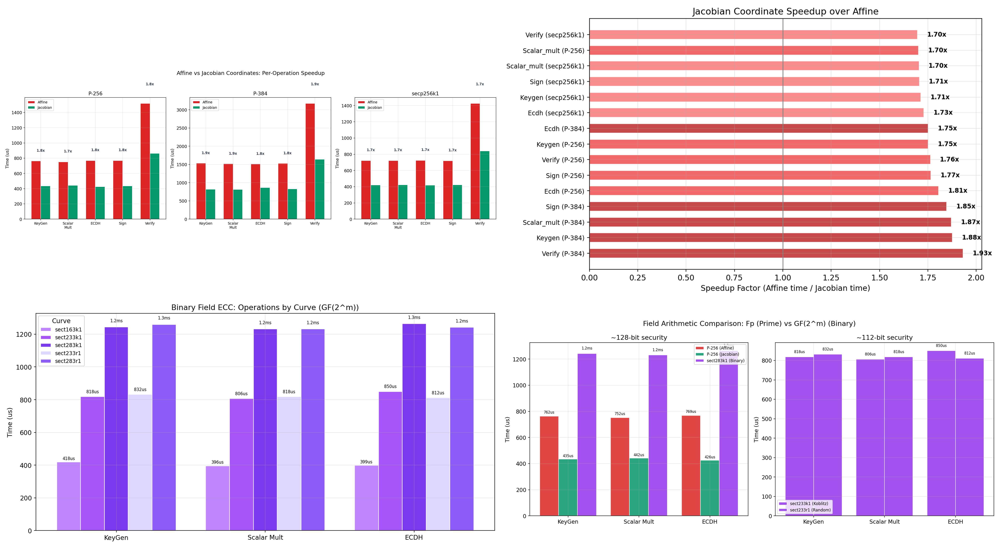
</p>

**Why we started with affine coordinates and then added Jacobian:**
 
We initially implemented all ECC operations using affine coordinates `(x, y)` for pedagogical reasons: each intermediate point can be verified with `is_on_curve()`, the formulas map directly to textbook math, and debugging is straightforward. The cost is that every point addition and doubling requires a modular inversion (~80-100x the cost of a multiplication).
 
Jacobian coordinates `(X, Y, Z)` where `x = X/Z^2, y = Y/Z^3` eliminate these inversions entirely during scalar multiplication. Only one inversion is needed at the very end when converting back to affine. A naive operation count (treating one inversion as ~80-100 multiplications) would suggest a large speedup, but the **measured** speedup on this hardware is a consistent **1.7-2x** (e.g. ~1.72x for secp256k1, growing to ~1.9x for P-384). The gap between the naive estimate and the measured figure is itself an interesting result: NTL's modular inversion (built on GMP) is far better optimized than the 80-100 multiplication rule of thumb assumes, so eliminating inversions buys less than the simplified model predicts. The benefit grows with field size, since inversion becomes relatively more expensive in larger fields.
 
The `chart_affine_vs_jacobian.png` and `chart_jacobian_speedup.png` charts show the measured speedup per operation and curve. The `use_jacobian` parameter in the API allows switching between both modes for direct comparison.
 
### Prime Field vs Binary Field
 
Binary field curves operate over GF(2^m) where elements are polynomials with binary coefficients. The key arithmetic differences are: addition is XOR (extremely fast, no carries), squaring is linear (insert zeros between bits), but polynomial multiplication is more complex in software than modular integer multiplication.
 
Our implementation includes 5 SEC 2 standard curves: three Koblitz curves (sect163k1, sect233k1, sect283k1) where `a in {0,1}` enables special optimizations, and two random curves (sect233r1, sect283r1) for comparison.
 
The `chart_binary_curves.png` shows performance across all 5 binary curves, and `chart_prime_vs_binary.png` compares prime field vs binary field at equivalent security levels (~128 bits: P-256 vs sect283k1).

### Detailed Analysis

The detailed collage shows how each algorithm scales internally and the distribution of individual measurements:

<p align="center">
   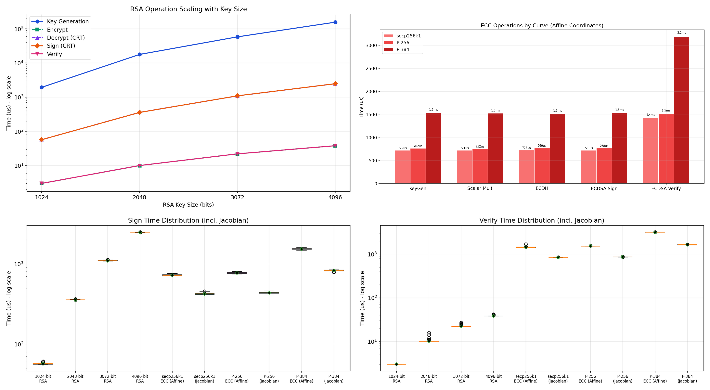
</p>

Notable observations:

- **RSA scaling is super-polynomial**: key generation time grows roughly as O(k^3) to O(k^4) with key size k due to the primality testing involved. RSA-4096 keygen takes ~156 ms (median) vs ~1.9 ms for RSA-1024, an ~80x increase for a 4x key size increase, and it is also the highest-variance operation (mean ~185 ms, min ~6 ms, max ~596 ms) because of the probabilistic prime search.
- **ECC scaling between curves is linear in field size**: P-384 (384-bit field) is roughly 2x slower than P-256 (256-bit field) across all operations. This is expected since field arithmetic cost scales as O(n^2) with field element size.
- **ECDSA verify takes ~2x the time of ECDSA sign**: this is because verification requires two scalar multiplications (u1*G + u2*Q) compared to one in signing (k*G), plus additional modular arithmetic.
- **Low variance in ECC operations**: the box plots show very tight distributions for ECC, while RSA key generation has high variance due to the probabilistic nature of prime search.

### Compiler Optimization Flags

We also measured how the compiler optimization level affects ECC, by recompiling the engine with different `g++` flag sets and re-running the same operation (scalar multiplication and ECDH on secp256k1). Run it with:

```bash
make compare-compiler-flags        # writes results/compiler_flags.csv + chart_compiler_flags.png
```

<p align="center">
   
</p>

The expected pattern is a large jump from `-O0` to `-O1`/`-O2` and a near-plateau afterwards (`-O3`, `-Ofast`, `-march=native`). The reason is structural: most of the ECC cost is big-integer modular arithmetic delegated to **GMP**, which is linked already compiled with its own assembly and is therefore *unaffected* by the project's flags. The flags only optimize the C++ "glue" (coordinate logic, scalar-multiplication loops, type conversions). This is exactly why the project standardizes on `-O2`: it captures essentially all the achievable gain without the timing unpredictability of `-O3` or the loss of portability of `-march=native`. (`-Ofast` behaves like `-O3` here because integer crypto has no floating-point in its hot path, so `-ffast-math` does nothing.)

### OpenSSL Baseline Comparison

To put our numbers in perspective, we compare against OpenSSL 3.0.2 -- a production reference implementation that uses assembly-optimized routines, platform-specific SIMD instructions, and constant-time algorithms. The comparison was run on the same machine via `openssl speed` (50s per operation).

A caveat up front: this comparison is indicative, because `openssl speed` and our benchmark harness do not measure exactly the same work (see the interpretation below). The table reports our median (100 iterations, ECC in Jacobian coordinates) next to OpenSSL's measured throughput.

| Operation | Ours (us) | OpenSSL (us) | Ratio |
|-----------|-----------|--------------|-------|
| **RSA-3072 sign** | 1,089 | 1,192 | ours 1.09x faster* |
| **RSA-3072 verify** | 22 | 24 | ours 1.08x faster* |
| **RSA-4096 sign** | 2,490 | 2,695 | ours 1.08x faster* |
| **RSA-4096 verify** | 38 | 41 | ours 1.08x faster* |
| **ECDSA P-256 sign** | 441 | 13 | OpenSSL 34.4x faster |
| **ECDSA P-256 verify** | 865 | 40 | OpenSSL 21.7x faster |
| **ECDH P-256** | 431 | 30 | OpenSSL 14.2x faster |
| **ECDSA P-384 sign** | 825 | 499 | OpenSSL 1.7x faster |
| **ECDSA P-384 verify** | 1,632 | 404 | OpenSSL 4.0x faster |
| **ECDH P-384** | 866 | 473 | OpenSSL 1.8x faster |

<sub>The apparent RSA advantage is a measurement artifact, not real superiority</sub>


> **To regenerate these numbers on your hardware**, run both benchmarks on the same machine:
> ```bash
> make benchmark           # Our implementation (full suite + charts)
> make compare-openssl     # OpenSSL reference (50s per op)
> ```
> Then compare the CSV outputs in `results/` (`summary_latest.csv` vs `openssl_baseline.csv`).

**Interpretation:**

**On RSA, the times are the same order of magnitude, but the comparison is not strictly fair.** At first glance our RSA times are comparable to OpenSSL's and even ~8-9% lower. This should *not* be read as our implementation being faster: it would be surprising for a teaching implementation to beat a production library, and a closer look shows the two are not measuring the same work. The reason both land in the same ballpark is that RSA private-key cost is dominated by CRT modular exponentiation, and both NTL/GMP and OpenSSL implement this with comparably mature techniques (Montgomery reduction, windowed exponentiation, assembly limb multiplication). Note that, contrary to a common assumption, **OpenSSL does not use GMP**: it has its own arbitrary-precision library (`BIGNUM`) with hand-written assembly. Two independent, well-optimized bignum engines performing similarly at these key sizes is exactly what we should expect, and that is the legitimate conclusion here.

**Why our implementation appears faster.** The small edge does not reflect efficiency; the two measurements simply do not count the same work, and four factors all push in the same direction:

- **RSA blinding.** OpenSSL applies base blinding to private-key operations by default, as a timing/side-channel countermeasure (multiply by a random factor before the exponentiation, undo it after). These are extra modular multiplications that our textbook implementation does not perform, OpenSSL deliberately does *more* work for security.
- **Padding & encoding.** OpenSSL's sign builds the `DigestInfo` structure and applies EMSA-PKCS#1 v1.5 padding; our measurement times essentially the bare `s = h^d mod n`.
- **Abstraction layer.** OpenSSL 3.x routes operations through its provider architecture and the `EVP` API, adding per-call overhead (algorithm fetch, parameter handling) absent from our direct primitive call.
- **Measurement harness.** `openssl speed` measures sustained throughput by counting operations in a fixed time window (including per-call setup); ours brackets only the operation with `std::chrono`.

In short, our implementation looks faster because it measures *less* work and *without* the protections OpenSSL includes. The honest takeaway: we **cannot claim to beat OpenSSL on RSA**; we can say both are bignum-bound and comparable, and that our RSA modexp operates at the same order of efficiency as a production library.

**On ECC, OpenSSL is much faster and the size of the gap is itself informative.** For P-256, OpenSSL is 14-34x faster because it ships hand-written assembly specifically for this curve (the most common on the Internet), with constant-time, heavily optimized field arithmetic. But for P-384 the gap collapses to 1.7-4x: with fewer curve-specific optimizations for this less common curve, OpenSSL's implementation comes much closer to a general-purpose one like ours. This contrast shows the ECC gap comes not from the algorithm but from the degree of low-level (curve-specific assembly) tuning, and that an NTL-based implementation reaches reasonable performance in the absence of such tuning. Our implementation uses affine/Jacobian coordinates over NTL's generic field arithmetic, validating intermediate points on the curve.

**Conclusion**: The RSA vs ECC comparative ratios in our benchmarks are directionally correct. The absolute ECC times are slower than production, but the *relative* comparison between RSA and ECC at equivalent security levels holds, because both are measured under identical conditions (same compiler, same library, same hardware, same harness).

<details>
<summary>Reproducing the OpenSSL baseline</summary>

```bash
# Run the OpenSSL comparison script
bash scripts/compare_openssl.sh results 10

# Or manually with openssl speed:
openssl speed rsa1024 rsa2048 rsa3072 rsa4096
openssl speed ecdsap256 ecdsap384
openssl speed ecdhp256 ecdhp384
```
</details>

### Benchmark Methodology

The benchmark engine implements several best practices for reproducible and statistically sound measurements:

**Timing**: We use `std::chrono::high_resolution_clock` which provides microsecond resolution on Linux. Our analysis showed that for operations above 100us (which all crypto operations are), `chrono` is equivalent to `rdtsc` in terms of measurement quality. The dominant source of variance is OS scheduling and cache effects, not clock resolution.

**Warm-up**: Each benchmark performs 3 warm-up iterations that are discarded before recording. This ensures the CPU caches are primed and the NTL library has performed any lazy initialization.

**Statistics**: Rather than reporting only the mean (which is sensitive to outliers, especially in key generation), we report the full distribution: mean, median, standard deviation, min, max, and P5/P95 percentiles. The median is the most reliable metric for comparison since RSA keygen can have extreme outliers due to unlucky prime searches.

**Reproducibility**: Using `-s fixed` (the default) seeds the RNG with a deterministic value, so the same key material is generated across runs. This eliminates variance from different key sizes or lucky/unlucky prime candidates. Use `-s random` for production-like measurements with natural variance.

**Fair comparison**: Both RSA and ECC are compiled with the same flags and run on the same hardware in the same process. The headline benchmarks use `-O2` (without `-march=native`) for portability and comparability. Compiler optimization affects ECC more than RSA because RSA delegates its hot path to pre-compiled NTL/GMP library code while ECC has more custom C++ in its critical path -- however, the effect is bounded: most of the gain happens between `-O0` and `-O2`, and higher levels (`-O3`, `-Ofast`, `-march=native`) add little, because the arithmetic core lives in GMP (linked pre-compiled with its own assembly) and is untouched by the project's flags. This is quantified by the `make compare-compiler-flags` experiment.

### External Benchmarking Frameworks

Our current benchmark engine is custom-built to output clean CSV data for analysis. For future iterations, two external frameworks are worth considering:

**Google Benchmark** ([github.com/google/benchmark](https://github.com/google/benchmark)) is the industry standard for C++ microbenchmarking. Key advantages over our current approach: automatic iteration count calibration (it runs enough iterations to achieve statistical stability rather than using a fixed count), built-in CPU frequency scaling detection, per-benchmark memory allocation tracking, and native support for parameterized benchmarks (e.g., testing multiple key sizes in a single benchmark definition). It outputs JSON/CSV and integrates with [benchmark-compare](https://github.com/google/benchmark/blob/main/docs/tools.md) for comparing results across runs. Integration would look like:

```cpp
#include <benchmark/benchmark.h>

static void BM_RSA_Sign(benchmark::State& state) {
    int bits = state.range(0);
    auto rng = create_rng("fixed", 0);
    auto keypair = RSA::generate_key(*rng, bits);
    BigInt hash_val = SHA256::hash_to_bigint("test");
    hash_val = hash_val % keypair.public_key.n;

    for (auto _ : state) {
        RSA::sign(hash_val, keypair.private_key, true);
    }
}
BENCHMARK(BM_RSA_Sign)->Arg(2048)->Arg(3072)->Arg(4096);

BENCHMARK_MAIN();
```

### Individual Chart Gallery

The 11 individual charts generated by the benchmark suite are available for detailed inspection:

<details>
<summary>Click to expand individual charts</summary>
Summary Heatmap
All algorithms, operations, and parameters in a single view. Rows are grouped by type (RSA, ECC Affine, ECC Jacobian, ECC Binary) with color intensity on log scale.
<p align="center">
   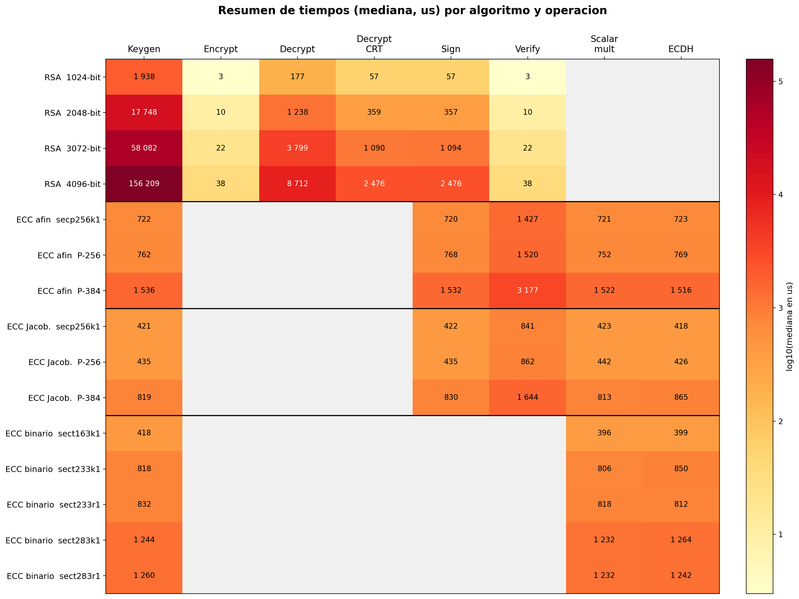
</p>
Key Generation Comparison
All key generation times across RSA sizes, ECC curves (affine, Jacobian), and binary field curves. Logarithmic scale.
<p align="center">
   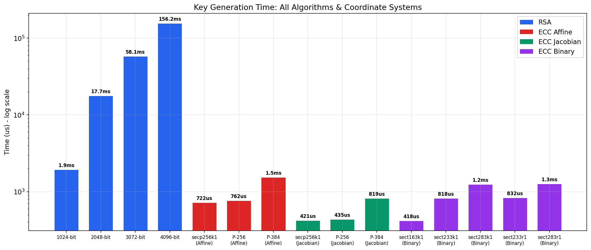
</p>
Sign & Verify at Equivalent Security
Grouped comparison at NIST-equivalent security levels including Jacobian overlay.
<p align="center">
   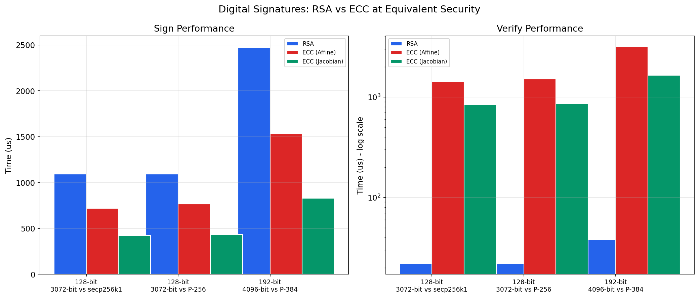
</p>
Performance Speedup Ratios
Horizontal bars showing ECC's advantage (red) or RSA's advantage (blue) at each security level. Log scale on x-axis.
<p align="center">
   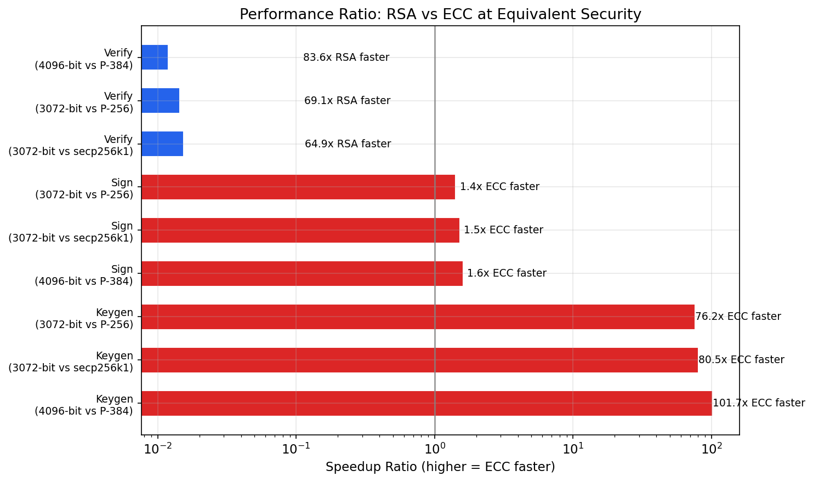
</p>
RSA Scaling with Key Size
All RSA operations on a log scale showing how performance degrades with key size.
<p align="center">
   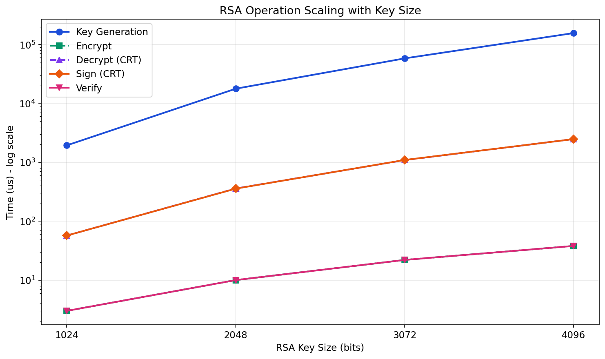
</p>
ECC Operations by Curve (Affine)
Grouped bars comparing all ECC operations across the three prime field curves using affine coordinates.
<p align="center">
   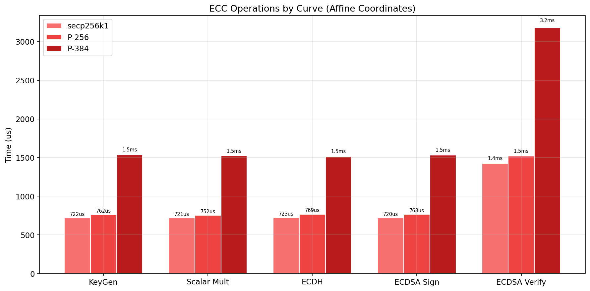
</p>
Affine vs Jacobian Coordinates
Per-curve, per-operation comparison between affine and Jacobian with speedup factors annotated.
<p align="center">
   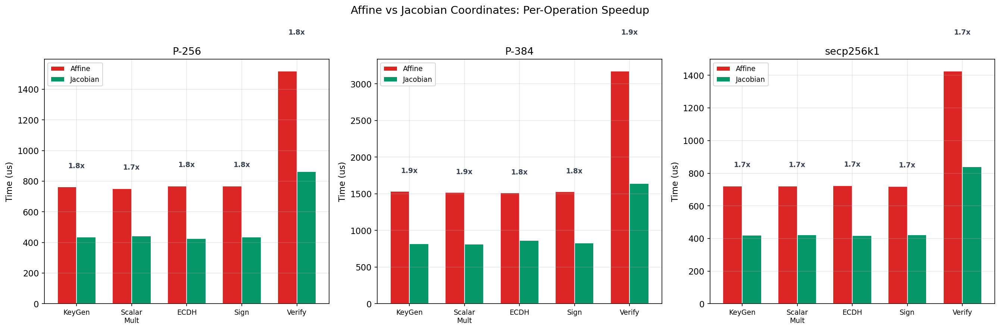
</p>
Jacobian Speedup Summary
Horizontal bars showing the measured Jacobian speedup factor for each operation and curve, sorted from highest to lowest.
<p align="center">
   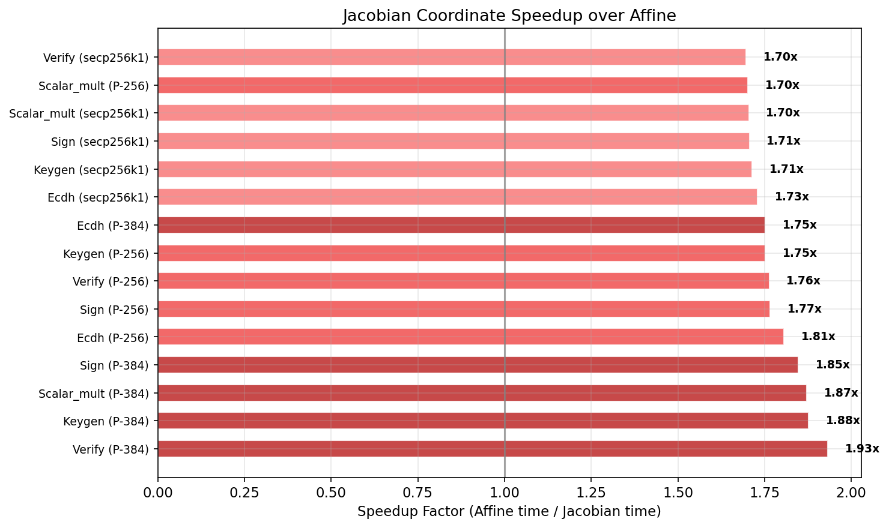
</p>
Binary Field Curves
Performance comparison across all 5 SEC 2 binary field curves (3 Koblitz + 2 random).
<p align="center">
   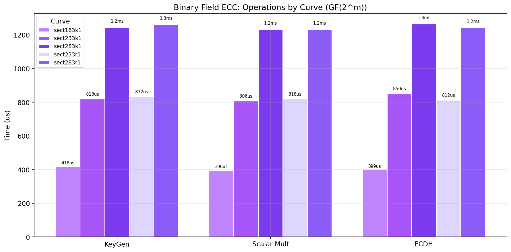
</p>
Prime vs Binary Field
Direct comparison of prime field (Fp) and binary field (GF(2^m)) at equivalent security levels.
<p align="center">
   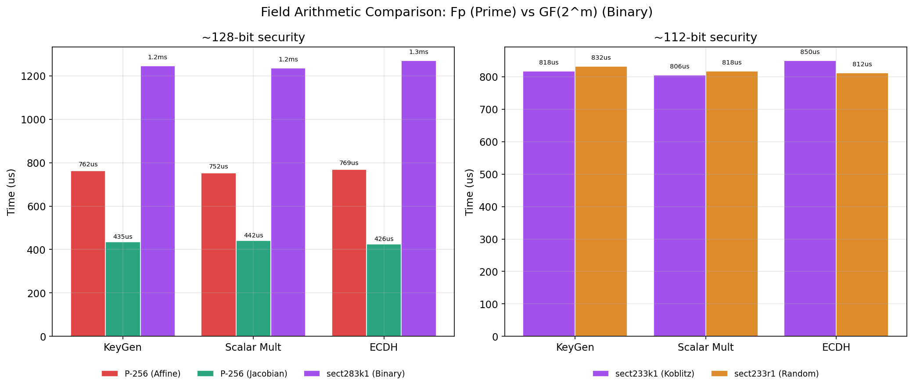
</p>
Timing Distributions
Box plots from raw per-iteration data showing measurement stability, including Jacobian variants alongside affine.
<p align="center">
   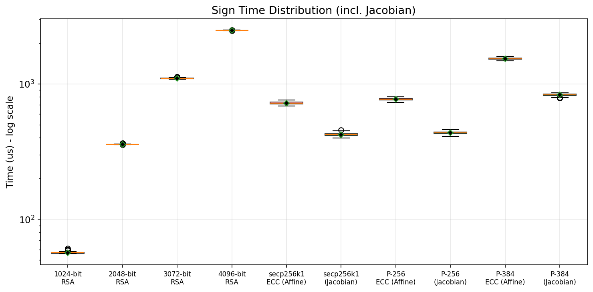
</p>
<p align="center">
   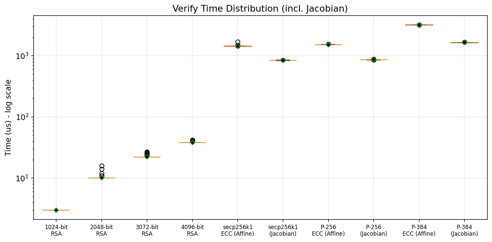
</p>
</details>